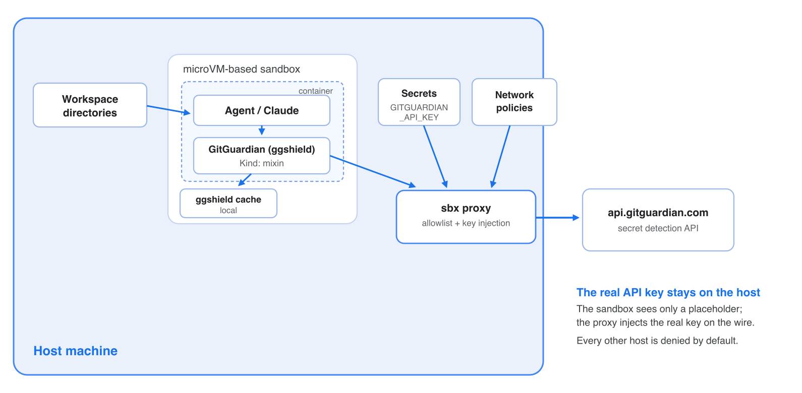

# sbx kit for gitguardian

A [Docker Sandboxes](https://docs.docker.com/ai/sandboxes/) **mixin** that adds
[GitGuardian](https://www.gitguardian.com/)'s
[`ggshield`](https://github.com/GitGuardian/ggshield) secret scanner to any
agent sandbox. It installs `ggshield` from a pinned, digest-verified GitHub
release at sandbox creation and wires up proxy-injected API-key auth for
`api.gitguardian.com` - so the agent can scan its workspace for hardcoded
secrets, but the real API key never enters the sandbox.

## Why this kit exists

AI coding agents generate and paste code fast, and hardcoded credentials slip
in - API keys, tokens, private keys in fixtures. ggshield catches them before they are committed or sent to third parties. Running it inside a
sandbox means the scanner (and the code it scans) executes in an isolated
microVM: your `~/.aws` / `~/.ssh` / `~/.docker/config.json` are not mounted, and
the GitGuardian API key is held on the host and injected by the proxy only on
outbound calls to `api.gitguardian.com` - the container sees a placeholder.

The kit doesn't just *offer* scanning - it **enforces** it. At sandbox creation
`ggshield` is installed as an **AI hook** for every coding assistant it supports
(Claude Code, Codex, Copilot, Cursor and VS Code), so whichever
agent the sandbox runs, its own actions are scanned for secrets automatically.
That turns secret scanning from advice the agent might skip into a deterministic
gate sitting directly on the agent's authorized output path (see
[Automatic enforcement](#automatic-enforcement-ai-hook)).

## Architecture



**The key isolation property:** `ggshield` inside the microVM only ever holds a
placeholder value for `GITGUARDIAN_API_KEY`. When it calls the GitGuardian API,
the sbx proxy rewrites the `Authorization: Token …` header with the real key
(sourced from the host) on the wire.

Egress is also proxy-mediated, but note that the kit's four hosts are **added
to** the host's network policy, not a replacement for it - see
[How auth and egress work](#how-auth-and-egress-work).

## Usage

This is a mixin, so it layers onto a base agent with `--kit`.
It will automatically add ggshield ai hooks to the agent, protecting your prompts and tool calls from containing secret.

### Setup

1. Create an API key in the GitGuardian dashboard
   (**API → Personal access tokens**, or a Service Account) with the `scan`
   scope.

   > **Use a scan-only token.** This kit only needs `scan` (plus optionally
   > `scan:create-incidents`). A broad Personal Access Token carrying
   > `incidents:write`, `members:write`, `api_tokens:write`, `ip_allowlist:write`,
   > etc. undercuts the whole point of the kit - if that key is ever misused, the
   > blast radius is your entire workspace. Prefer a dedicated **Service Account**
   > token scoped to `scan` only. The kit isolates the key from the sandbox; a
   > least-privilege scope isolates the *damage* if the key leaks host-side.
2. **Store the value** with `sbx secret set`. The service name must be
   `gitguardian`, matching the credential's `service` in `spec.yaml`:

   ```console
   # Global - paste the PAT at the interactive prompt:
   sbx secret set gitguardian

   # Scope the PAT to a single sandbox (e.g. one named "jfrog"):
   sbx secret set gitguardian --sandbox jfrog
   ```

   > **Never put the PAT on the command line.** A literal in an `echo ... |`
   > pipeline or after `-t` is written to your shell history and is visible in `ps` while the command runs -
   > exactly the kind of leak this kit exists to catch. `sbx`'s own help marks
   > `-t/--token` as "less secure: visible in shell history". Use the
   > interactive prompt, or feed it from a secret manager so the value is never
   > a literal:
   >
   > ```console
   > op read op://vault/gitguardian/token | sbx secret set gitguardian
   > ```

### Starting a sandbox

```console
sbx run claude  --kit "oci://docker.io/gitguardian/ggshield-kit:latest" .
sbx run codex   --kit "oci://docker.io/gitguardian/ggshield-kit:latest" .
sbx run copilot --kit "oci://docker.io/gitguardian/ggshield-kit:latest" .
sbx run cursor  --kit "oci://docker.io/gitguardian/ggshield-kit:latest" .

# From this git repo:
sbx run claude --kit "git+https://github.com/GitGuardian/sbx-kits-ggshield.git" .

# From a local clone:
sbx run claude --kit ./ .
sbx run codex  --kit ./ .
```

One `spec.yaml` covers every agent; see [Publishing](PUBLISHING.md) for the
current digest.

Note that inside the sandbox, you can run ggshield manually:

```console
agent@claude-project:~/project$ ggshield api-status
agent@claude-project:~/project$ ggshield secret scan path -r .   # working tree
agent@claude-project:~/project$ ggshield secret scan repo .      # full git history + working tree
```

You can confirm the setup inside a running sandbox with `ggshield machine
doctor`. In a correctly provisioned sandbox it reports:

```console
✓ Authentication — token reaches GitGuardian
✓ AI hooks — installed for: Claude Code, Codex, Copilot CLI, Cursor
✓ Scope `scan` — required by the AI and git hooks
```

> **`machine doctor` exits non-zero here, by design.** It also reports three
> failures that this kit deliberately causes: `Git hooks — not configured`
> Judge the setup by the three checks above, not by the exit status.


## Credentials

The kit declares one credential, `gitguardian`, and marks it `required`. Note
that `required` is advisory in `sbx` v0.39: with no binding it prints
`WARN: required credential has no binding; sandbox will start without it` and
starts anyway - `ggshield` then runs with the `proxy-managed` placeholder and
every API call fails as unauthenticated. Bind the credential before you rely on
the kit.


Inside the container `GITGUARDIAN_API_KEY` is set to the placeholder
`proxy-managed` (the kit exports it via `environment.variables`, because
`gitguardian` is a custom service that sbx does not auto-materialize). The proxy
rewrites the `Authorization: Token <key>` header with the real value only on
requests to `api.gitguardian.com`, so the real token never enters the sandbox.

## How auth and egress work

GitGuardian's API authentication scheme is `Authorization: Token <api_key>`, so the kit injects with `format: "Token %s"`.

The kit declares four hosts:

| Host | Why |
| --- | --- |
| `github.com` | Release page entry point for the install tarball (302-redirects) |
| `objects.githubusercontent.com` | Redirect target for the release asset |
| `release-assets.githubusercontent.com` | Alternate redirect target for release assets |
| `api.gitguardian.com` | Runtime scan/verify API calls |

**These four are additive to the host's network policy, not a restriction on
it.** A kit's `permissions.network.allow` can only widen egress; what the
sandbox can actually reach is the union of the kit's entries and the policy set
by `sbx policy init`. Measured in a live sandbox created after
`sbx policy init balanced`:

```console
$ sbx policy ls <sandbox>
NETWORK
  allow 197 hosts from <profile-id>, local-policy
```

`balanced` alone permits a broad developer allowlist - `pypi.org`,
`registry.npmjs.org`, `github.com`, `**.openai.com`, `api.anthropic.com` and
many more all returned `200`, while `example.com` and `wikipedia.org` returned
`403` from the proxy. If you want egress genuinely limited to what this kit
needs, initialize the host policy with `sbx policy init deny-all` (or a
restrictive governance profile) so the kit's four entries are the whole
allowlist, and narrow a single sandbox further with `sbx run --deny-network`.

### EU workspace / self-hosted instances

`ggshield` defaults to `api.gitguardian.com`. For the EU workspace or a
self-hosted GitGuardian, set `GITGUARDIAN_INSTANCE` for the agent and add that
host to **both** `permissions.network.allow` and the credential's
`apiKey.inject[].domain` in `spec.yaml` (fork the kit) - the proxy only injects
into domains the kit declares.

## Version pinning

The install command pins `GGSHIELD_VERSION=1.53.0` and a per-arch `SHA256`
(`x86_64-unknown-linux-gnu` and `aarch64-unknown-linux-gnu`). To bump: edit
`spec.yaml`, update the version string and both SHA256s (the `sha256sum` of
each release tarball from the
[releases page](https://github.com/GitGuardian/ggshield/releases)).


## License

The kit files are provided as-is. `ggshield` itself is distributed under its
own [license](https://github.com/GitGuardian/ggshield/blob/main/LICENSE).
